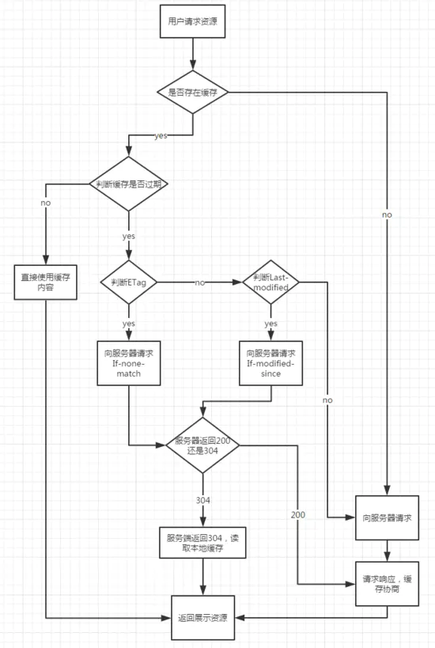

<!--
 * @Author: your name
 * @Date: 2021-12-06 15:07:54
 * @LastEditTime: 2021-12-06 15:23:52
 * @LastEditors: Please set LastEditors
 * @Description: 打开koroFileHeader查看配置 进行设置: https://github.com/OBKoro1/koro1FileHeader/wiki/%E9%85%8D%E7%BD%AE
 * @FilePath: \vuepress-starter\docs\fontend\html\BrowserInputUrl.md
-->
# 浏览器输入URL

### 一个页面从输入 URL 到页面加载显示完成，这个过程中都发生了什么？

1. 浏览器的地址栏输入URL并按下回车。
2. 浏览器查找当前URL是否存在缓存，并比较缓存是否过期。
3. DNS解析URL对应的IP。
4. 根据IP建立TCP连接（三次握手）。
5. HTTP发起请求。
6. 服务器处理请求，浏览器接收HTTP响应。
7. 渲染页面，构建DOM树。
8. 关闭TCP连接（四次挥手）。

## 1. URL
输入URL后，会进行解析（URL的本质就是统一资源定位符）
URL一般包括几大部分：
* protocol，协议头，譬如有http，加密的https，ftp等
* host，主机域名或IP地址
* port，端口号（通常端口号不常见是因为大部分的都是使用默认的端口所以隐藏，如HTTP默认端口80，HTTPS默认端口443。）
* path，目录路径
* query，即查询参数
* fragment，即#后的hash值，一般用来定位到某个位置

## 2. 缓存
根据下图的逻辑，判断是直接使用缓存内容还是重新向服务器请求资源


## 3. DNS域名解析

我们知道在地址栏输入的域名并不是最后资源所在的真实位置，域名只是与IP地址的一个映射。网络服务器的IP地址那么多，我们不可能去记一串串的数字，因此域名就产生了，**域名解析的过程实际是将域名还原为IP地址的过程**。
首先浏览器先检查本地hosts文件是否有这个网址映射关系，如果有就调用这个IP地址映射，完成域名解析。

如果没找到则会查找本地DNS解析器缓存，如果查找到则返回。

如果还是没有找到则会查找本地DNS服务器，如果查找到则返回。

最后迭代查询，按根域服务器 ->顶级域,.com->第二层域，baidu.com ->子域，www.baidu.com的顺序找到IP地址。

## 4. TCP连接
在通过第一步的DNS域名解析后，获取到了服务器的IP地址，在获取到IP地址后，便会开始建立一次连接，这是由TCP协议完成的，主要通过三次握手进行连接。

* 第一次握手： 建立连接时，客户端发送syn包（seq=x）到服务器，并进入SYN_SENT状态，等待服务器确认；

* 第二次握手： 服务器收到syn包，必须确认客户的SYN（ack=x+1），同时自己也发送一个SYN包（seq=y），即SYN+ACK包，此时服务器进入SYN_RECV状态；

* 第三次握手： 客户端收到服务器的SYN+ACK包，向服务器发送确认包ACK(ack=y+1），此包发送完毕，客户端和服务器进入ESTABLISHED（TCP连接成功）状态，完成三次握手。

## 5. 浏览器向服务器发送HTTP请求
完整的HTTP请求包含请求起始行、请求头部、请求主体三部分。
常用的请求头部（部分）
```js
Accept: 接收类型，表示浏览器支持的MIME类型
（对标服务端返回的Content-Type）
Accept-Encoding：浏览器支持的压缩类型,如gzip等,超出类型不能接收
Content-Type：客户端发送出去实体内容的类型
Cache-Control: 指定请求和响应遵循的缓存机制，如no-cache
If-Modified-Since：对应服务端的Last-Modified，用来匹配看文件是否变动，只能精确到1s之内，http1.0中
Expires：缓存控制，在这个时间内不会请求，直接使用缓存，http1.0，而且是服务端时间
Max-age：代表资源在本地缓存多少秒，有效时间内不会请求，而是使用缓存，http1.1中
If-None-Match：对应服务端的ETag，用来匹配文件内容是否改变（非常精确），http1.1中
Cookie: 有cookie并且同域访问时会自动带上
Connection: 当浏览器与服务器通信时对于长连接如何进行处理,如keep-alive
Host：请求的服务器URL
Origin：最初的请求是从哪里发起的（只会精确到端口）,Origin比Referer更尊重隐私
Referer：该页面的来源URL(适用于所有类型的请求，会精确到详细页面地址，csrf拦截常用到这个字段)
User-Agent：用户客户端的一些必要信息，如UA头部等
```
## 6. 浏览器接收服务器的响
服务器在收到浏览器发送的HTTP请求之后，会将收到的HTTP报文封装成HTTP的Request对象，并通过不同的Web服务器进行处理，处理完的结果以HTTP的Response对象返回，主要包括状态码，响应头，响应报文三个部分。
状态码主要包括以下部分

* 1xx：指示信息–表示请求已接收，继续处理。
* 2xx：成功–表示请求已被成功接收、理解、接受。
* 3xx：重定向–要完成请求必须进行更进一步的操作。
* 4xx：客户端错误–请求有语法错误或请求无法实现。
* 5xx：服务器端错误–服务器未能实现合法的请求。

响应头主要由Cache-Control、 Connection、Date、Pragma等组成。

响应体为服务器返回给浏览器的信息，主要由HTML，css，js，图片文件组成。

常用的响应头部（部分）：
```js
Access-Control-Allow-Headers: 服务器端允许的请求Headers
Access-Control-Allow-Methods: 服务器端允许的请求方法
Access-Control-Allow-Origin: 服务器端允许的请求Origin头部（譬如为*）
Content-Type：服务端返回的实体内容的类型
Date：数据从服务器发送的时间
Cache-Control：告诉浏览器或其他客户，什么环境可以安全的缓存文档
Last-Modified：请求资源的最后修改时间
Expires：应该在什么时候认为文档已经过期,从而不再缓存它
Max-age：客户端的本地资源应该缓存多少秒，开启了Cache-Control后有效
ETag：请求变量的实体标签的当前值
Set-Cookie：设置和页面关联的cookie，服务器通过这个头部把cookie传给客户端
Keep-Alive：如果客户端有keep-alive，服务端也会有响应（如timeout=38）
Server：服务器的一些相关信息
```
## 7. 页面渲染
前面有提到http交互，那么接下来就是浏览器获取到html，然后解析，渲染
1. 解析HTML，构建DOM树
2. 解析CSS，生成CSS规则树
3. 合并DOM树和CSS规则，生成render树
4. 布局render树（Layout/reflow），负责各元素尺寸、位置的计算
5. 绘制render树（paint），绘制页面像素信息
6. 浏览器会将各层的信息发送给GPU，GPU会将各层合成（composite），显示在屏幕上

## 8. 关闭TCP连接或继续保持连接
通过四次挥手关闭连接(FIN ACK, ACK, FIN ACK, ACK)。
